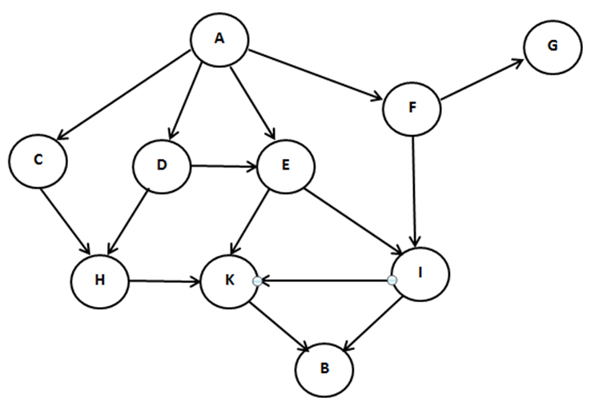

# Lab 01 – Tìm kiếm (Search)

Bài lab thuộc học phần Trí tuệ nhân tạo nâng cao. Mục tiêu: thực hành đọc dữ liệu đồ thị (danh sách kề) và triển khai/chạy các thuật toán tìm kiếm (ví dụ: BFS/DFS/…) trong notebook.

> Bài làm nằm trong file `my_lesson4.ipynb`.

## Nội dung và cấu trúc

- `my_lesson4.ipynb` – Notebook chính chạy các bước của bài lab (đọc dữ liệu, chạy thuật toán, in kết quả, v.v.).
- `dske.txt`, `dske1.txt` – Dữ liệu đồ thị dạng danh sách kề (adjacency list).
- `dothi.png` – Hình minh họa đồ thị.
- `search.pdf`, `search (HD).pdf` – Tài liệu tham khảo về các thuật toán tìm kiếm.
- `my_lesson4.html` – Phiên bản xuất HTML của notebook.

## Cho đồ thị 

## Định dạng dữ liệu (danh sách kề)

Các tệp `dske*.txt` có cấu trúc chung như sau:

1) Dòng 1: số lượng đỉnh, ví dụ:

```
10
```

2) Từ dòng 2 trở đi: mỗi dòng mô tả một đỉnh và các đỉnh kề của nó, dạng “U V1 V2 … Vk”. Các phần tử cách nhau bởi dấu cách. Ví dụ trích từ `dske.txt`:

```
A C E F D
B
C H
D E H
E K I
F I G
G
H K
I K B
K B
```

Ghi chú:
- Một số dòng có thể chỉ có nhãn đỉnh (ví dụ `B`) vì không có đỉnh kề.
- Nhãn đỉnh trong ví dụ là các chữ cái in hoa (A, B, C, …, K), tổng số đỉnh khớp với dòng đầu.

## Yêu cầu môi trường

- Python 3.8+ (khuyến nghị 3.10 trở lên)
- VS Code với các extension: Python, Jupyter (khuyến nghị)
- Hoặc Jupyter Notebook/JupyterLab cài sẵn trong máy

## Cách chạy notebook (VS Code trên Windows)

1) Mở thư mục dự án này trong VS Code.
2) Mở tệp `my_lesson4.ipynb`.
3) Chọn kernel/Interpreter Python (góc trên phải của notebook).
4) Chạy tuần tự các cell từ trên xuống dưới (Run All hoặc chạy từng cell).
5) Khi cần, chỉnh đường dẫn input trong mã cho đúng tệp dữ liệu bạn muốn dùng (`dske.txt` hoặc `dske1.txt`). Thông thường, đường dẫn tương đối như `./dske.txt` sẽ hoạt động khi chạy từ thư mục gốc này.

## Kết quả mong đợi

- Notebook sẽ đọc dữ liệu đồ thị từ `dske.txt` và thực thi các thuật toán tìm kiếm tương ứng (ví dụ: duyệt BFS/DFS, tìm đường đi,… tùy nội dung cell).
- Kết quả hiển thị dưới dạng in ra màn hình (stdout).

## Tài liệu tham khảo

- `search.pdf` và `search (HD).pdf` trong thư mục dự án.
- Giáo trình/slide môn học liên quan đến các thuật toán tìm kiếm (BFS, DFS, …)

---